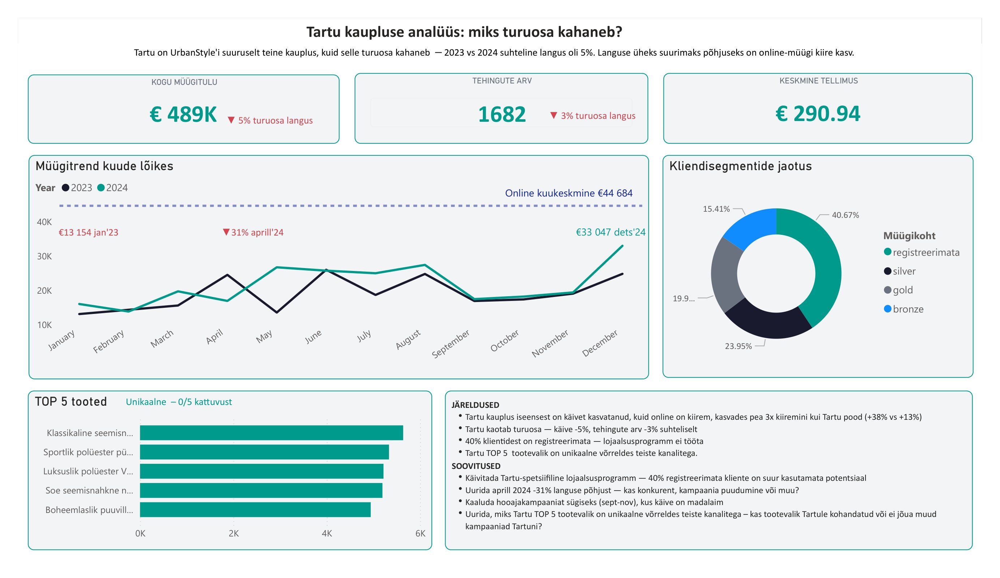

# Nädal 6: visualiseerimise andmelugu

## Mida ma tegin
- Meie meeskond analüüsis UrbanStyle'i (US) nelja asukohta. 
- Minu roll sel nädalal oli analüüsida ja visualiseerida US Tartu kaupluse dashboardi ja narratiivi.
- Ühise otsusena grupis otsustasime taas visualiseerimiseks kasutada US andmeid perioodil 2023-2024, kuna 2025. ja 2026. aasta andmed on ebatäielikud ja moonutaksid ebamõistlikult negatiivselt UrbanStyle'i likviidsust. 
- Lõin KPI kaardid, mis näitavad, kui palju US valitud perioodil müügitulu teenis, mitu klienti neil perioodi lõpuks oli ning kui suur oli kasv.
- Joondiagrammile visualiseerisin US-i perioodi müügitulu trendi, mis näitab selgelt kuude kaupa kasvu.
- Lisasin ka sliceri, kust CEO saab soovitud perioodi kohta andmeid vaadata, et muuta graafik interaktiivsemaks. 

## Peamised õpikohad  
- Arendasin teadmisi ja oskusi Power BI kasutamisel. Suutsin meelde jätta, kust miskit muuta saab.
- Eriliseks proovikiviks said KPI kaartide visualiseerimised - iga väike raam ja taust tulevad eri kohtadest. Murdsin läbi!

## Äriline väärtus
Dashboard muudab andmed lihtsasti mõistetavaks. Tartu kaupluse juhil pole aega SQL-päringuid jooksutada — ta vajab ühte vaadet, kust on kohe näha, kas käive kasvab, millal on tipud ja millal mõõnad. Interaktiivne slicer tähendab, et küsimusele "kuidas läks eelmisel kvartalis?" saab vastuse sekunditega, mitte tunni pärast. See on vahe andmete omamise ja andmete kasutamise vahel.

## Kuidas kasutasin AI-d?
- Kasutasin taas Claude'i ja mõneti ka ChatGPT'd juhendite tõlgendamiseks ja Power BI kasutamiseks. Põrgatasin pisut ka äritõlgendusi.

## Individuaalsed failid
- [Minu dashboardi Power BI fail](individual/Urbanstyle_week6_dashboard_Triin.pbix)
- [Minu dashboardi screenshot](individual/week6_Tartu_dashboard_screenshot.png)
- [Minu narratiiv](individual/week6_Tartu_narrative.md)
- [Minu executive summary](individual/week6_executive_summary.md)

## Tiimifailid
- [Tiimi koondraport](week6_team_combined_view.md)
- [Meeskonnatöö slaidid](https://docs.google.com/presentation/d/1yxUbckxenA22lvdZTj7cDzkRZiqxVss4P9S3SuMcmtY/edit?usp=sharing)
